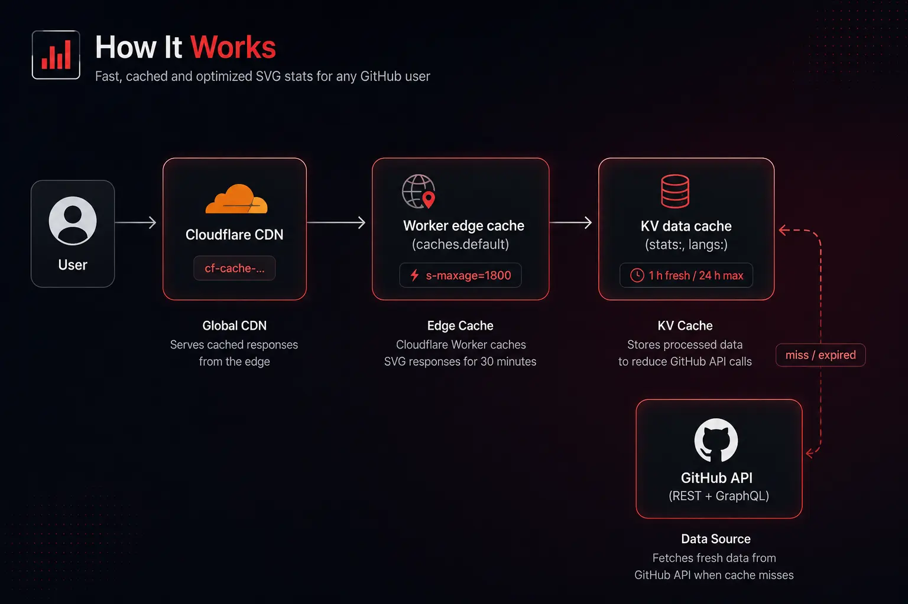

# GitHub Stats API


GitHub profile statistics and top-languages **badges rendered as SVGs on the fly**, served from a Cloudflare Worker at the edge — no server, no database, no cost per request beyond Workers.

Drop a badge into your GitHub profile README and it always renders: the data layer caches GitHub responses in KV and serves stale data with a background refresh instead of failing when GitHub rate limits hit.

## Live badges

```
[](https://github.com/Aanttrax)
[](https://github.com/Aanttrax)
```

## Benefits

- **Zero infrastructure.** The whole service is a single Worker. It runs on Cloudflare's edge network next to your users, with no cold starts and no monthly server bill.
- **Your GitHub quota is protected.** GitHub API requests are expensive and rate-limited. This project caches the *data*, not the rendered image, so one username never burns quota per badge style.
- **Badges never break.** If the cached data is stale (up to 24 h) it is still served immediately while a fresh copy is fetched in the background. A badge that shows slightly old numbers is better than a broken image.
- **No cache fragmentation.** The cache key is the username (`stats:torvalds`, `langs:torvalds`), not the full request URL. Colors, layouts, and icon toggles cost nothing extra against GitHub.
- **Fast by default.** Three cache layers: Cloudflare CDN, Worker edge cache, and the KV data cache — most requests never touch GitHub at all.
- **Ship with confidence.** Every push to `master` runs typecheck + tests and deploys automatically via GitHub Actions.

## How it works



1. **Cloudflare CDN** (`cf-cache-status`) caches the final SVG globally.
2. **Worker edge cache** (`caches.default`, `X-Cache-Status`) short-circuits repeated requests per data center.
3. **KV data cache** is the source of truth for GitHub data:
   - fresh (< 1 h) → served without touching GitHub;
   - stale (1–24 h) → served immediately, refreshed in the background with `ctx.waitUntil`;
   - missing or expired → fetched from GitHub now and stored.

## Tech stack

| Layer | Technology |
|-------|------------|
| Runtime | Cloudflare Workers (TypeScript) |
| Data cache | Cloudflare KV (`STATS_CACHE` namespace) |
| GitHub API | Octokit (REST) + hand-rolled GraphQL query |
| Rendering | Hand-written SVG templates |
| Tests | Vitest + `@cloudflare/vitest-pool-workers`, mocked network via `fetchMock` |
| Tooling | Wrangler v4, TypeScript strict checks |
| CI/CD | GitHub Actions (`cloudflare/wrangler-action`) |

## API reference

### `GET /api`

Renders a GitHub stats card.

| Query param | Default | Description |
|-------------|---------|-------------|
| `username` | — | GitHub username (required) |
| `show_icons` | `true` | Show star/fork icons |
| `count_private` | `false` | Include private repositories (requires a token) |
| `hide_border` | `false` | Hide the card border |
| `title_color` | `#94e2d5` | Title color (hex) |
| `icon_color` | `#cba6f7` | Icon color (hex) |
| `text_color` | `#cdd6f4` | Text color (hex) |
| `bg_color` | `#1e1e2e` | Background color (hex) |

### `GET /api/top-langs`

Renders the most used languages by bytes of code.

| Query param | Default | Description |
|-------------|---------|-------------|
| `username` | — | GitHub username (required) |
| `layout` | `default` | `default` or `compact` |
| `hide_border` | `false` | Hide the card border |
| `title_color` | `#94e2d5` | Title color (hex) |
| `text_color` | `#cdd6f4` | Text color (hex) |
| `bg_color` | `#1e1e2e` | Background color (hex) |
| `langs_count` | `5` | Number of languages (clamped to 1–20) |

## Local development

Prerequisites: [Node.js](https://nodejs.org/) and [nvm](https://github.com/nvm-sh/nvm).

```bash
# Use the exact Node version this project was built with
nvm use

# Install dependencies
npm ci

# Run the Worker locally (KV is emulated, nothing touches production)
npm run dev

# Typecheck
npx tsc --noEmit

# Run the test suite (mocked GitHub network, no real requests)
npm test
```

Local secrets live in `.dev.vars` (gitignored):

```bash
GITHUB_TOKEN=your_github_token
```

The local Worker uses an emulated KV namespace; production data is never touched by `wrangler dev`.

## Deployment and CI/CD

Push to `master` and GitHub Actions does the rest:

```
push → npm ci → npx tsc --noEmit → npx vitest run → wrangler deploy
```

- The workflow is `.github/workflows/deploy.yml` and can also be triggered manually from the Actions tab.
- The Node version is pinned in `.nvmrc` and shared between your machine and CI.
- Repository secrets required: `CLOUDFLARE_API_TOKEN` (API token with the "Edit Cloudflare Workers" template).

Production secrets are set once on the Worker, never in the repository:

```bash
wrangler secret put GITHUB_TOKEN
```

## Project layout

```
src/
├── index.ts            # Router (entry point)
├── types.ts            # Shared types (Env, Stats, options)
├── cache.ts            # Edge cache + KV data cache (stale-while-revalidate)
├── params.ts           # Query param parsing/validation
├── github.ts           # GitHub REST + GraphQL clients
├── stats.ts            # /api handler
├── languages.ts        # /api/top-langs handler
└── svg/                # SVG rendering helpers and card templates
test/
└── index.spec.ts       # Endpoint tests (9) with mocked GitHub
```

## Security

- No secrets are committed: `.dev.vars` and `.wrangler/` are gitignored.
- Worker secrets (`GITHUB_TOKEN`) are stored in Cloudflare and never appear in code or CI logs.
- The KV namespace ID and account ID in `wrangler.jsonc` identify resources; they are not credentials.
- Per-IP rate limiting (default 120 requests/min, configurable via `RATE_LIMIT_MAX` and `RATE_LIMIT_WINDOW_SECONDS`) blocks abusive clients with `429 Too Many Requests` before they can exhaust the GitHub quota. It is fail-open: a storage error never breaks a badge.
